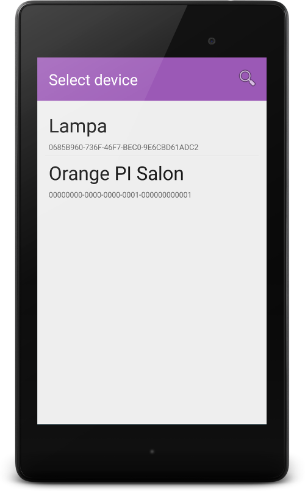
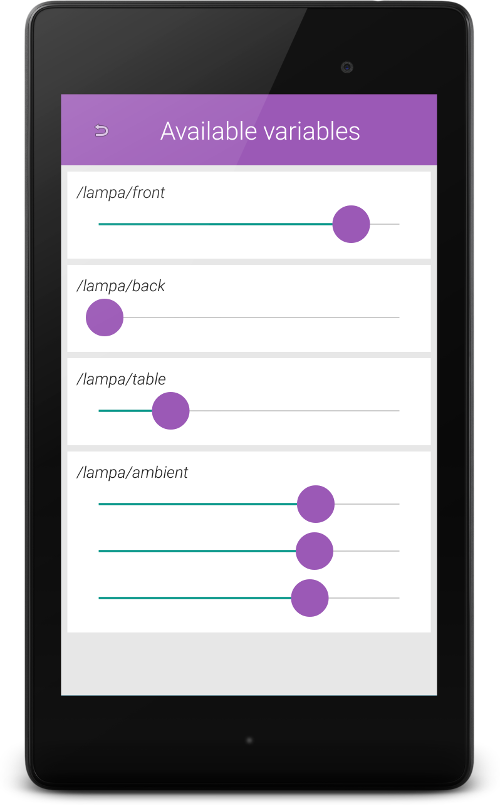

# What is it ?

It is a simple universal[^1] controler/controlpoint for OCF/OIC[^2] devices. 

[^1]: Currently it supports only three types of resources but it can be easily extended to suport more. 

[^2]: Open Connectivity Foundation https://openconnectivity.org/, former Open Interconnect Consortium


# Screenshots
## Device list view


## Device resources view


# Dependecies

```
https://github.com/pwiklowski/libocf-android
```
Make sure that libocf library location is configured in settings.gradle and  build.gradle:


#License
MIT
